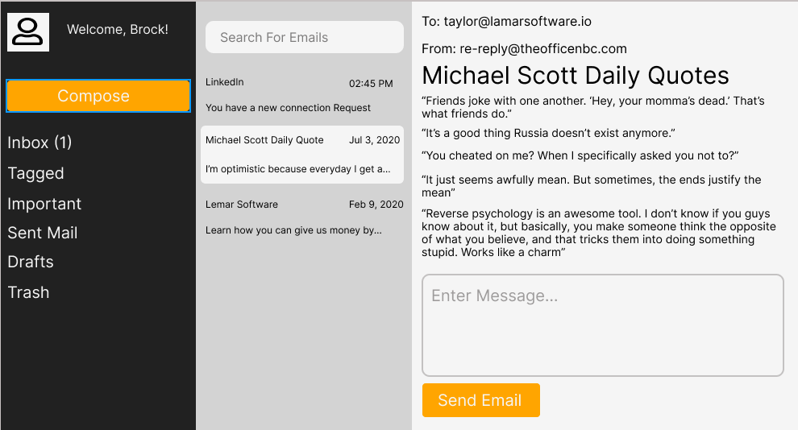
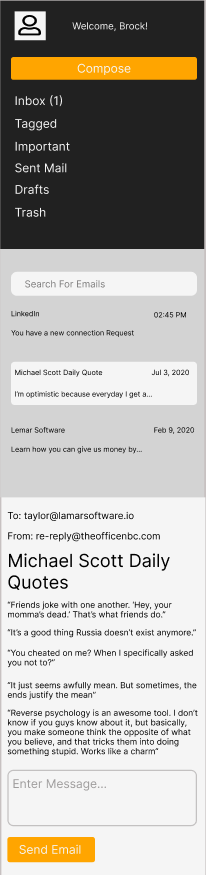

# Email Template Webpage

Welcome to the Email Template Webpage project, a meticulously designed interface aimed at enhancing the user's email viewing experience. This project showcases a dynamic and user-friendly email template, perfect for displaying emails in a structured and intuitive manner.

## Features

This webpage is crafted with attention to detail, offering a comprehensive set of features that cater to the needs of email users. The layout includes:

- **Sidebar Navigation**: A sleek sidebar that enhances user navigation through the webpage, featuring:
  - **User Welcome**: A personalized welcome message that greets users by their name.
  - **Compose Button**: A prominently placed button, encouraging users to compose new emails effortlessly.
  - **Folder List**: An organized list of email folders for efficient email management, including Inbox (with an unread email count), Tagged, Important, Sent Mail, Drafts, and Trash.

- **Search Bar**: A conveniently located search bar at the top, allowing users to quickly find specific emails.

- **Email List**: A detailed list showcasing emails with essential information such as the sender, date and time received, and a brief preview of the email content.

- **Email Content View**: An immersive section where the selected email's content is displayed, including:
  - **Recipient Information**: Displays the recipient's email address.
  - **Sender Information**: Highlights the sender's email address.
  - **Email Subject**: Shows the subject line of the email.
  - **Email Body**: Presents the full content of the email for thorough reading.

- **Reply Section**: A dedicated area for composing replies, featuring:
  - **Message Input Box**: A text area designed for typing out responses.
  - **Send Button**: A button that sends the composed reply, enhancing the email interaction process.

## Instructions

Embark on recreating the expected layout by utilizing the `index.html` and `style.css` files provided in this folder. Your primary focus should be on crafting the layout and applying styles as outlined. This phase does not require the implementation of functionality, allowing you to concentrate on building a visually appealing and structured layout for the project.

## Mobile Responsiveness

A key requirement for this project is mobile responsiveness. The webpage must be designed to ensure a seamless and user-friendly experience across all devices, particularly on mobile and tablet screens. This entails implementing responsive design principles to adjust the layout, navigation, and content visibility to accommodate various screen sizes and orientations.

## Notes

- This project is confined to HTML and CSS, intentionally excluding the dynamics of adding emails. It serves as a practical exercise in replicating layout and styling, aiming to refine your web development skills.
- While the project's core does not include dynamic email functionalities, you are encouraged to explore and implement these capabilities to elevate the design further.

## Expected Output

For a visual guide, below are the expected outputs for different screen sizes, showcasing how the project should appear on desktop views versus mobile and tablet screens.

### Expected Output for Desktop View

### Expected Output for Mobile and Tablet View

